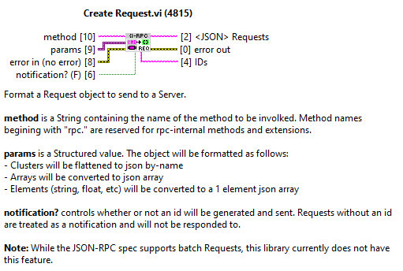
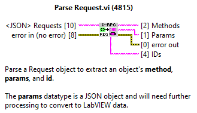
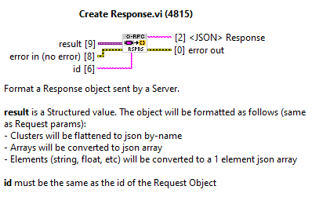
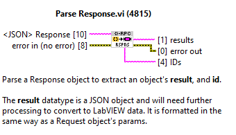
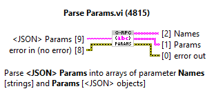
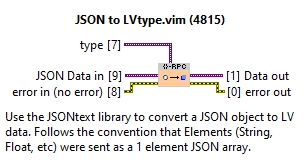
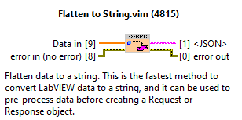
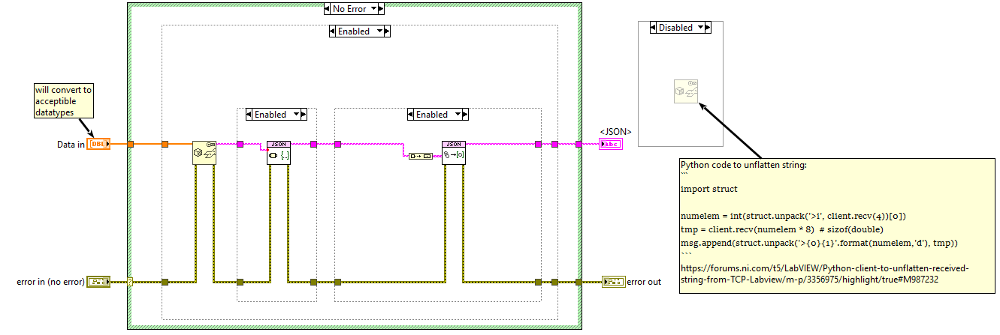
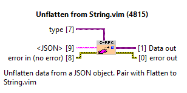
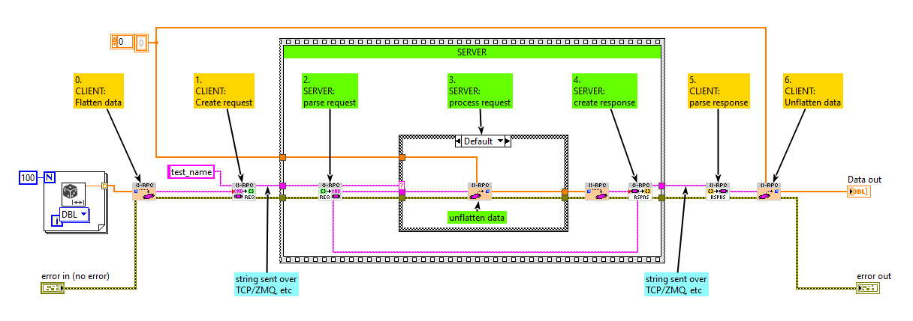

# JSON-RPC
JSON-RPC is a LabVIEW library for generating and parsing [JSON-RPC](https://www.jsonrpc.org/) messages. Initially developed for use by [Instrument Framework](https://github.com/levylabpitt/Instrument-Framework)

## Getting Started
- JSON-RPC is developed and packaged in LabVIEW 2019
- Download and install using the VI Package Manager as described [here](https://levylabpitt.github.io/)

## Usage

### Core Methods

#### Create Request.vi

#### Parse Request.vi

#### Create Response.vi

#### Parse Response.vi

#### Parse Params.vi

This VI breaks out RPC parameters into names and parameter objects, but does not convert the objects to LV data.

### Data Manipulation

#### JSON to LVtype.vi

By default, `Create Request.vi` and `Create Response.vi` will convert LV data to a string using whatever strategy is used by JSONtext. `JSON to LVType.vi` assists in converting a string back to a LV datatype.

#### Flatten to String.vi

#### Unflatten from String.vi

### Examples

## Contributing

Contact [Patrick Irvin](https://github.com/ciozi137)

## License

[BSD-3](https://opensource.org/licenses/BSD-3-Clause)
